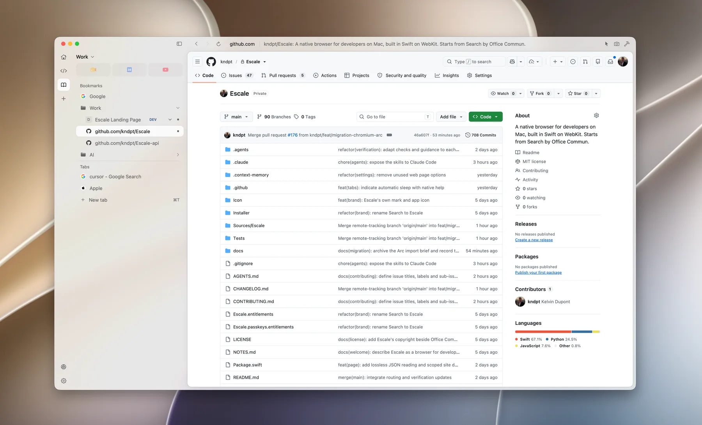

  <picture>
    <source media="(prefers-color-scheme: dark)" srcset="images/mark-cream.svg">
    
  </picture>

<h1 align="center">Escale</h1>

  A native browser for developers on Mac. 
  Built in Swift, on WebKit, for the pages around your code.

  <a href="https://escalebrowser.com/download"><strong>Download for Mac</strong></a>
  &nbsp;·&nbsp; macOS 14 or later &nbsp;·&nbsp;
  <a href="https://github.com/kndpt/Escale-releases/releases">Release notes</a>
  &nbsp;·&nbsp;
  <a href="https://escalebrowser.com">escalebrowser.com</a>

  

Documentation, pull requests, dashboards and the app on localhost. Escale keeps each project's pages in a space of its own, and gets you back to them from the keyboard. It is free, needs no account, and is a pre-release: use it beside your usual browser for a week of project work, then tell us what got in the way.

## Where was that pull request?

Press <kbd>⇧⌘K</kbd>. Bearings finds the pull requests and issues you have seen in this space, in an open tab, a sleeping one or only in its history. One line each, with whether it is open, draft, merged or closed. Return takes you back to its tab, or reopens its last address.

- **No account to start.** The state is read once from a GitHub page already open in a tab, without waking it. An older state stays visible, dimmed, with its age.
- **Connect a space to keep it current.** Settings › GitHub. Then the lines on screen, six at most, are refreshed from GitHub, private repositories too once you add them. Never what you type, nor repositories you have not visited. The authorisation stays in the keychain, one per space.
- **A mode, not another place.** From <kbd>⌘K</kbd> or <kbd>⌘T</kbd>, press <kbd>Tab</kbd>: the capsule at the end of the field switches to GitHub, and what you typed stays.

## Bearings, one bar from the keyboard

| | |
|---|---|
| <kbd>⌘T</kbd> | Go somewhere new. Starts from where you are: this space, its open tabs, its bookmarks and their environments. A tab is created only when you confirm a new destination. |
| <kbd>⌘K</kbd> | Switch to an open tab, by name. |
| <kbd>⇧⌘K</kbd> | Find a pull request or issue you have seen on GitHub. |
| <kbd>⌘L</kbd> | Change where this page goes. Type an address and you go there; type words and you search. |

Bearings starts from what is already on your Mac. It has no model, does not learn from you and sends nothing anywhere until you press Return.

## A space for each project

Each space has its own tabs, bookmarks and pinned pages, and its own history, passwords, cookies and extensions. Restored tabs load their page when you select them, not before. Tabs sit in the sidebar, or across the top with <kbd>⇧⌘S</kbd>; an address bar above the page shows the site, then the page's title, as in Arc's developer mode.

## Wait. Is this dev, staging or prod?

Give a bookmark its environments, each an exact address. In Bearings, walk onto the bookmark and the environment it is on is already ringed; <kbd>←</kbd> <kbd>→</kbd> choose another, Return opens it. The name you chose sits beside the address before you act. A label is a reminder you set, not a guard: Escale shows it only at the address you configured.

## Also aboard

- **Hide anything, for good.** <kbd>⇧⌘H</kbd>, then click a cookie banner, a newsletter overlay, a rail of "related" nonsense. On that site it is still gone next time, before the page has drawn a single frame.
- **An ad blocker that runs before the page.** Third-party trackers and ad networks are stopped at the network level. On by default, off per site if something breaks.
- **The request beside the page.** A network panel next to the site you are working on: URL, query, headers and body laid out to be read, and JSON responses as a tree you can search and copy from. It sits beside WebKit's inspector; it does not replace Chrome DevTools.
- **Chrome extensions, without Chrome.** Paste a Chrome Web Store link. It runs on WebKit's own extension engine, the one Safari uses. macOS 15.4 or later.
- **Passwords and passkeys, in your keychain.** Offered once a sign-in has actually worked, offered again under the field when you click it, never filled on its own.
- **Bring what you had.** Bookmarks and history from Chrome in a click; local profiles from Arc and other Chromium browsers, Firefox, Zen or Orion; Safari exports. Into the space you choose.
- **Inspect and capture.** Select an element for its CSS and dimensions (<kbd>⌥⌘V</kbd>), or save the page as a PNG (<kbd>⌥⌘S</kbd>). Nothing is uploaded.
- **Localhost, by space.** The loopback pages you visited, by host and port. No port scanning.
- **Reading mode** (<kbd>⇧⌘R</kbd>), **video that floats above every app** (<kbd>⇧⌘P</kbd>), **shortcuts you can change**, light, dark and Escale's own warm colours.

## Where does it all go?

No sync, no account, no cloud.

| What | Where it is |
|---|---|
| Passwords | The macOS login keychain, tagged by space. |
| History, bookmarks, open tabs, hidden elements | Separate files per space, in `~/Library/Application Support/Escale/`. |
| Cookies and site data | A separate WebKit store per space. |
| Extensions | Their own lists, folders and permissions, per space. |
| GitHub, if you connect a space | Its authorisation in the keychain, one per space. The states it has seen in a file of its own: no titles, no addresses. |
| Anything else | Nowhere. There is no server. |

What does leave your Mac: the pages you ask for, their icons, the extensions you add from the Chrome Web Store, one small request a day for the latest release and, in a space you connect to GitHub, a request for the state of the pull requests and issues on screen. No telemetry, no analytics, no crash reports, no AI assistant.

## Not a fit yet

- Sync across devices, or Windows and Linux.
- Chromium-only tools: Lighthouse, CDP, building Chrome extensions.
- A company-managed Chrome, or an extension WebKit cannot run.

## Install and updates

[escalebrowser.com/download](https://escalebrowser.com/download) always gives the latest disk image. Open it and drag Escale to Applications. Builds are signed and notarised by Apple.

Once a day, Escale reads `escalebrowser.com/appcast.json`, downloads a newer build and swaps it in for the next launch; nothing restarts on its own. An update is installed only when its hash matches the appcast and its signature comes from the same developer as the copy already installed.

This repository holds releases only; Escale's source is not published here. Each [release](https://github.com/kndpt/Escale-releases/releases) carries three files:

- `Escale.dmg`, the disk image, to install Escale;
- `Escale.zip`, what an installed Escale fetches to update itself;
- `appcast.json`, the version, build, SHA-256 of the ZIP and minimum macOS.

## Feedback

In Escale, **Help › Send Feedback…** opens a new issue here with your version, build and macOS already filled in. You can also [open one directly](https://github.com/kndpt/Escale-releases/issues/new). Issues are public: leave out anything private (addresses of internal sites, tokens, screenshots of your work). For something you'd rather not post, write to hello@escalebrowser.com.

Say what you did, what you expected and what happened. If Escale crashed, `~/Library/Application Support/Escale/crash.log` has the last trace; it never leaves your Mac unless you attach it.

---

Escale began from [Search](https://github.com/driceroland/Search) by Office Commun (MIT); both notices ship inside the app. The pull requests in the picture above belong to [kndpt/fernhill-admin](https://github.com/kndpt/fernhill-admin), a demo project.
